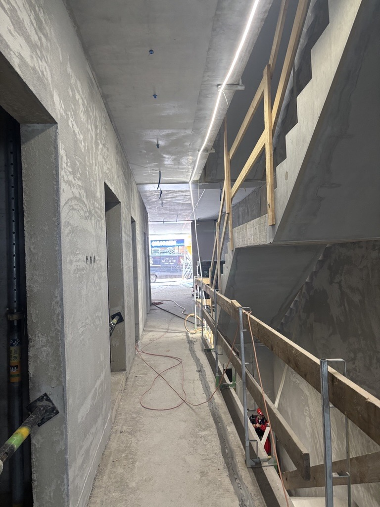
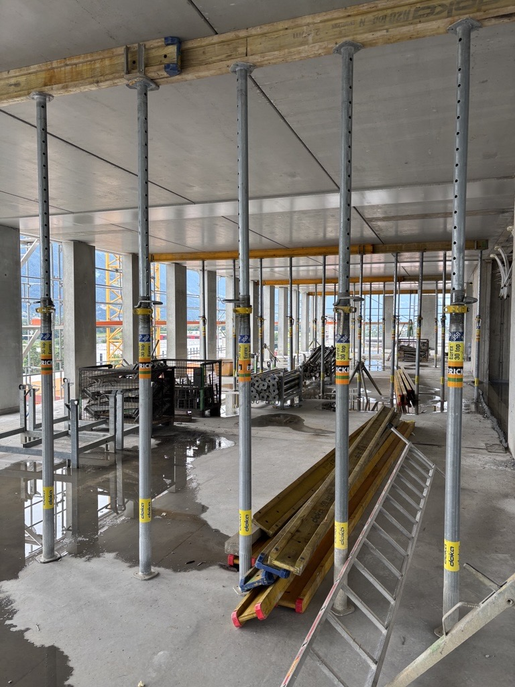
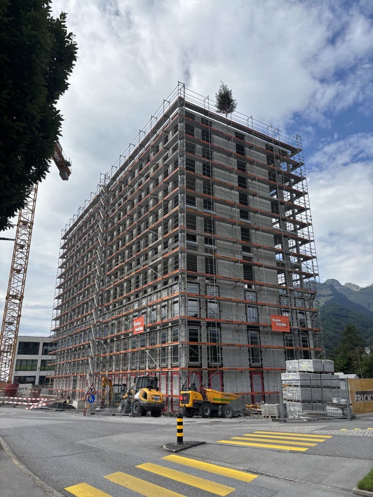
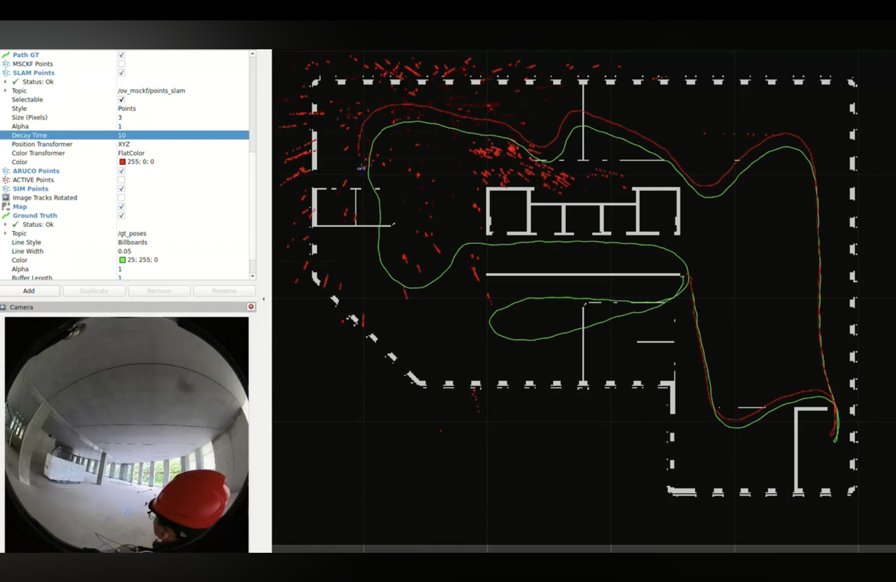
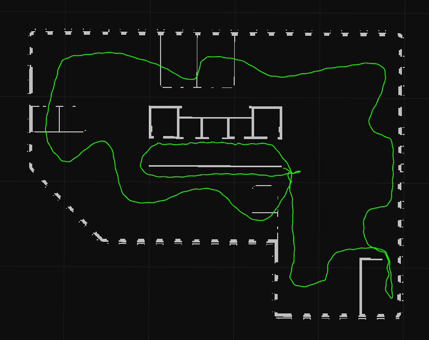
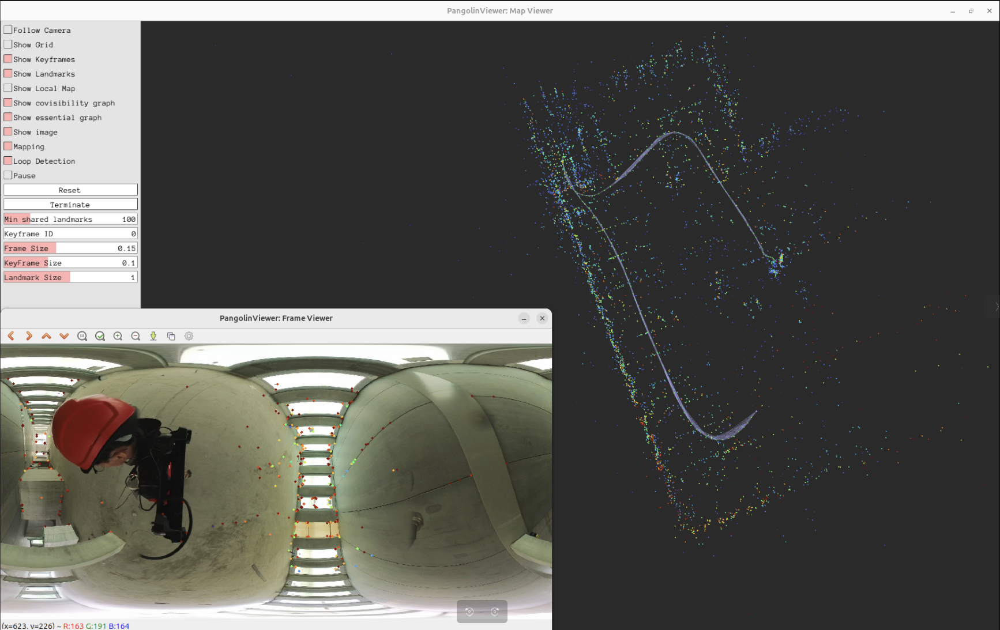

<!-- TOC start (generated with https://github.com/derlin/bitdowntoc) -->

<!-- TOC end -->

<!-- TOC --><a name="hilti-x-trimble-slam-challenge-2026"></a>
<h1 align="center" style="font-size: 35px;">
  Hilti x Trimble SLAM Challenge 2026
</h1>

- [Introduction: Visual-Inertial SLAM Challenge with Additional Building Floorplans](#introduction)
- [Dataset](#dataset)
   * [Dataset Floorplans](#dataset-floorplans)
   * [Dataset Properties](#dataset-properties)
   * [Environment Description](#environment-description)
   * [Ground Truth](#ground-truth)
   * [EuRoC Format](#euroc-format)
   * [Sensor Data & ROS Bags](#sensor-data-ros-bags)
   * [Image Decompression](#image-decompression)
   * [Image Inversion](#image-inversion)
- [Evaluation](#evaluation)
- [Devices](#devices)
   * [Camera (Visual-Inertial Sensor)](#camera-visual-inertial-sensor)
   * [Lidar (Ground Truth Acquisition)](#lidar-ground-truth-acquisition)
   * [Camera and IMU Calibration](#camera-and-imu-calibration)
- [Challenge Tools ROS](#challenge-tools-ros)
   * [Install Challenge Tools](#install-challenge-tools)
   * [OpenVINS Example](#openvins-example)
   * [Stella-VSLAM Example](#stella-vslam-example)

<!-- TOC --><a name="introduction"></a>
# Introduction: Visual-Inertial SLAM Challenge with Additional Building Floorplans

Accurate and reliable SLAM is a cornerstone of robotics, automation, and digital construction workflows. Yet real-world construction sites remain one of the most challenging environments for modern Visual-Inertial SLAM systems: changing lighting conditions, repetitive textures and partial building progress push even state-of-the-art algorithms to their limits.

To advance the field and establish a common benchmark for these demanding scenarios, [Hilti](http://hilti.com/), [Trimble](https://www.trimble.com/), and the [Dynamic Robot Systems Group](https://dynamic.robots.ox.ac.uk/) of University of Oxford have joined forces to launch the SLAM Challenge 2026.
Our intention is to provide an open and realistic dataset, captured directly on active construction sites, to evaluate and compare SLAM systems in real industrial conditions.

The winning teams will be awarded a prize money, so stay tuned for the full release on the **1st of February 2026**. The challenge winners will be announced at ICRA in June 2026.

<table width="100%">
  <tr>
    <td align="center" width="33%">
      
      <br>
      <em>Indoor 1</em>
    </td>
    <td align="center" width="33%">
      
      <br>
      <em>Indoor 2</em>
    </td>
    <td align="center" width="33%">
      
      <br>
      <em>Outdoor View</em>
    </td>
  </tr>
</table>

<!-- TOC --><a name="dataset"></a>
# Dataset
The goal of this challenge is to accurately localize the [camera](#camera-visual-inertial-sensor) within the provided floorplans [as described below](#openvins-example).

We are providing 5 samples for the early release (released 1st of December 2025). You can find the public folder [here](https://drive.google.com/drive/folders/19ajbmr7ByWxHiy1X4yqK8W02xUmePGLd?usp=drive_link) or you can directly download the rosbag from the table below: 
| Youtube Video | Rosbag Download | Ground Truth |
| :---: | :---: | :---: |
| [Floor_1_2025_05_05_run_1](https://youtu.be/CWM42dc7BLE) | [rosbag.db3](https://drive.google.com/file/d/1PT5qK7UpsAtU02QCTkAB1Tlvzt9k_16-/view?usp=drive_link) |  |
| [Floor_2_2025_05_05_run_1](https://youtu.be/C-Mdt5v9jyM) | [rosbag.db3](https://drive.google.com/file/d/1k45Ufau9T2y8w5GM0vjZbYuMTeMKn4gh/view?usp=drive_link) |  |
| [Floor_2_2025_10_28_run_1](https://youtu.be/kFmn1pZzGuY) | [rosbag.db3](https://drive.google.com/file/d/1QIJXWtxKeumwnOLKPsUdR-NvhW-ITbsx/view?usp=sharing) |  |
| [Floor_2_2025_10_28_run_2](https://youtu.be/8qetRNnEScs)| [rosbag.db3](https://drive.google.com/file/d/145Ramu4F3d74oOdzzSihlL0X6A5HDmFQ/view?usp=sharing) |  |
| [Floor_UG_2025_10_16_run_1](https://youtu.be/5dy1r1nFSzY) | [rosbag.db3](https://drive.google.com/file/d/1PoulmdfADZbfwLv7WyE9aTt8nMtSw_km/view?usp=sharing) |  |


The structure of the dataset folder is as follows:

```
BuchsIT/
└── floor_X/
    ├── floor_X.png
    └── date/
        ├── run_Y/
            ├── rosbag/
            │   └── rosbag.db3 # ROS 2 bag file
            │   └── metadata.yaml
            ├── trajectory.csv  # GT trajectory (Euroc format, Floor UG only)
            ├── floor_X_gt.png 
```

<!-- TOC --><a name="dataset-floorplans"></a>
## Dataset Floorplans
Together with the dataset, we provide floorplans in binary format, which can be converted into occupancy maps using the following [script](scripts/challenge_tools_ros/map_server.py) if needed.

<div align="center">
  
</div>

<!-- TOC --><a name="dataset-properties"></a>
## Dataset Properties
**Note on Floor 2**: This floor contains three different runs. Two of them were taken by different operators on the same day.

**Notes on Floor 2 - run 2 and Floor UG**: The recordings for these two runs start with **intentional** motion at the beginning of the recordings. This is a realistic challenge for this application.


<!-- TOC --><a name="environment-description"></a>
## Environment Description

We selected three different floors captured at various stages of the construction site's timeline:

- Floor UG: Underground level.
- Floor 1: First floor.
- Floor 2: Second floor.
  
Each sequence was captured in a construction site environment. Note that each run is a closed-loop trajectory, starting and finishing at the same location.


<!-- TOC --><a name="ground-truth"></a>
## Ground Truth

- Floor UG: We provide the quantitative ground-truth trajectory in the `floor_UG_gt.csv` file (EuRoC format).
  - **Note**: The ground truth was acquired using the [Lidar](#lidar-ground-truth-acquisition) system. The ground truth _does not perfectly align_ with the exact first frame of the video; instead, it begins $3.030716$ seconds after the start of the video. 
- Other Floors: We provide a qualitative visual reference (`floor_X_gt.png`) to indicate the expected trajectory shape.

<!-- TOC --><a name="euroc-format"></a>
## EuRoC Format

The primary dataset is provided as **ROS 2 bags**. Nevertheless, we provide a [script](scripts/challenge_tools_ros/ros2bag_to_euroc.py) to allow users to easily convert a ros2bag into the EuRoC dataset format. Upon request, we are willing to provide the raw sensor data in the EuRoC dataset format. 


<!-- TOC --><a name="sensor-data-ros-bags"></a>
## Sensor Data & ROS Bags

### Topics Description

The provided files are ROS 2 bags. The dataset contains the following topics:
| Topic Name | Message Type | Description |
| :--- | :--- | :--- |
| `/cam0/image_raw/compressed` | `sensor_msgs/msg/CompressedImage` | Front Camera data (RGB, 1472×1440 resolution). Compressed to minimize file size. |
| `/cam1/image_raw/compressed` | `sensor_msgs/msg/CompressedImage` | Back Camera data (RGB, 1472×1440 resolution). Compressed to minimize file size. |
| `/imu/data_raw` | `sensor_msgs/msg/Imu` | Raw IMU data. |

<!-- TOC --><a name="image-decompression"></a>
## Image Decompression
To reduce the dataset file size, camera streams are stored as **Compressed Images**.
In order to address this, we provide a helper [node](scripts/challenge_tools_ros/image_conversion_node.py) that decompresses the video stream in real-time while the bag is playing.

<!-- TOC --><a name="image-inversion"></a>
## Image Inversion
The image sensors in the cameras are inverted. We have not artificially inverted them (as it would interfere with rolling shutter correction). For easier visualization we provide a simple [tool](scripts/challenge_tools_ros/rotate_image_180.py) to rotate the image by 180 degrees:
```
ros2 run challenge_tools_ros rotate_image_180.py /ov_msckf/trackhist
```
You can change the topic to another topic, such as `/cam0/image_raw`.
The rotated topic will be `/cam0/image_raw/rotated`, which you can then visualize to RViz.

<!-- TOC --><a name="evaluation"></a>
# Evaluation
The main evaluation metric will be the **Root Mean Square Error (RMSE)** calculated on the **Absolute Pose Error (APE)** between the estimated SLAM trajectory and the reference (Ground Truth) trajectory.

More insights on the exact evaluation procedure will be provided for the official release on the **1st of February**.


<!-- TOC --><a name="devices"></a>
# Devices
<!-- TOC --><a name="camera-visual-inertial-sensor"></a>
## Camera (Visual-Inertial Sensor)
Each run was captured using the **Insta360 One-RS 1-Inch Edition** ([Insta360 website](https://www.insta360.com/product/insta360-oners/1inch-360)).

- Sensors and Lenses: The camera is equipped with two 1-inch CMOS sensors (co-engineered with Leica). Each lens is a Leica Summicron-A 6.52 mm f/2.2 fisheye, providing an extremely wide field of view (approx. 200° per lens) for full 360° coverage.

- Shutter: The sensor uses an electronic (rolling) shutter.

- Integrated IMU: The camera includes a 6-axis Inertial Measurement Unit (3-axis gyroscope + 3-axis accelerometer). Motion data are internally recorded and embedded into video metadata.

<!-- TOC --><a name="lidar-ground-truth-acquisition"></a>
## LiDAR (Ground Truth Acquisition)

A high-accuracy ground truth trajectory was acquired using LiDAR-Inertial SLAM and can be used for validation. A LiDAR mapping device containing a **Hesai XT32 Lidar** ([Hesai website](https://www.hesaitech.com/product/xt16-32-32m/)) was rigidly attached to the Insta360 during the recordings. This sensor is used only to generate the reference trajectory and its data is not included in the provided ROS 2 bags.

<!-- TOC --><a name="camera-and-imu-calibration"></a>
## Camera and IMU Calibration
We provide camera and IMU calibration results which were obtained using the [Kalibr](https://github.com/ethz-asl/kalibr) toolbox. The original calibration recordings are also included in the [public drive](https://drive.google.com/drive/folders/1_rWXyflGOXej0sy4pdeLpj6Q33B1zSlU?usp=sharing), in case you wish to repeat or perform your own calibration.

**Note**: if you need to extract the raw IMU data, you must use the original raw .insv videos. For this purpose, we utilized the public repository [telemetry_parser](https://github.com/AdrianEddy/telemetry-parser).

<!-- TOC --><a name="challenge-tools-ros"></a>
# Challenge Tools ROS

We provide several tools to make working with SLAM Challenge 2026 data easier. These tools were developed using ROS2 Humble and Ubuntu 22.04.

<!-- TOC --><a name="install-challenge-tools"></a>
## Install Challenge Tools
First, create a ROS2 workspace (if you have not created one before), and then install the challenge tools:
```
mkdir ~/ros2_ws/src -p
cd ~/ros2_ws/src
git clone https://github.com/Hilti-Research/hilti-trimble-slam-challenge-2026.git
cd ~/ros2_ws
colcon build --symlink-install
```

<!-- TOC --><a name="openvins-example"></a>
## OpenVINS Example
We have tested and configured [OpenVINS](https://docs.openvins.com/getting-started.html), a leading open-source visual-inertial odometry system, to run on our dataset.

[Here](https://www.youtube.com/watch?v=GsbvdB7MyZE) is a video comparing OpenVINS with the ground truth (GT). It illustrates the LiDAR-based GT in detail and shows how the visual odometry (VO) from OpenVINS aligns with it. In the visualization, the green line represents the ground truth, while the red line corresponds to OpenVINS. Both lines represent full 6DOF trajectories.

<div align="center">
  
</div>

You can read the `gt_poses.csv` files and publish them to Rviz as follows:
```
ros2 launch challenge_tools_ros groundtruth_server.launch run_name:=floor_1_2025-05-05_run_1
```

Please, **note that these reference trajectories are provision and will be adjusted in the coming weeks**.

<!-- TOC --><a name="install-openvins-with-ros2"></a>
### Install OpenVINS with ROS2
We provide minimal instructions for installing OpenVINS with ROS2. More detailed information can be found in the [official documentation](https://docs.openvins.com/getting-started.html).

First, install the dependencies:
```
sudo apt update
sudo apt install libeigen3-dev libboost-all-dev libceres-dev
```

Then install OpenVINS:
```
cd ~/ros2_ws/src
git clone https://github.com/rpng/open_vins/
cd ~/ros2_ws
colcon build --symlink-install
```

<!-- TOC --><a name="run-openvins"></a>
### Run OpenVINS
We provide ready-to-use scripts and a calibrated configuration file for our device.

In **Terminal 1**, start OpenVINS:
```
ros2 launch challenge_tools_ros run_openvins.launch.py
```

In **Terminal 2**, play the bag (you can press the `space` key to pause and resume):
```
ros2 bag play /path/to/ros2/bag/folder -p
```

In **Terminal 3**, read and publish the floor plan:
```
ros2 run challenge_tools_ros map_server.py /path/to/floorplans/floor_X.png 0
```

In **Terminal 4**, apply the static transform (to align the start of the trajectory with the floor plan):
```
ros2 run tf2_ros static_transform_publisher [x] [y] [z] [roll] [pitch] [yaw] map global
```

The table gives the starting location of the camera device within the floor plan for the indicated rosbag:
| Sequence Name | Floor Plan | Transformation (x y z roll pitch yaw) |
|---------------|----------|----------|
|floor_1/2025-05-05/run_1|floor_1.png|36.15 21.75 1.00 1.71 0.00 0.00|
|floor_2/2025-05-05/run_1|floor_2.png|36.50 21.25 1.00 0.65 0.00 0.00|
|floor_2/2025-10-28/run_1|floor_2.png|39.50 11.25 1.00 0.80 0.00 0.00|

An example of `floor_2/2025-05-05/run_1` is shown below: <br>
<div align="center">
  
</div>

The OpenVINS trajectory has merely been aligned that start of the trajectory. It is not explicitly localized to the floorplan.

<!-- TOC --><a name="stella-vslam-example"></a>
## Stella-VSLAM Example
Stella-VSLAM is another open-source vSLAM system. It directly processes 360° equirectangular images. To install it, follow the instructions [here](https://stella-cv.readthedocs.io/en/latest/ros2_package.html).

<!-- TOC --><a name="run-stella-vslam"></a>
### Run Stella-VSLAM
In **Terminal 1**, start Stella-VSLAM:
```
ros2 launch challenge_tools_ros run_stella_vslam.launch.py \
    image_conversion:=false \
    config_path:=/path/to/challenge_tools_ros/config/hilti_stella_vslam/fisheye.yaml
```
By default, the `config_path` is set to `fisheye.yaml`, which is the monocular configuration for the front camera. <br>

Since we only provide raw sensor data from the Insta360, which contains separate images from the front and back lenses, you would need to stitch the images from both lenses if you are interested in 360° equirectangular SLAM. You must also modify the `equirectangular.yaml` file according to the resolution of your stitched image and set the `config_path`.

An example of Stella-VSLAM running on stitched images is shown below:
<div align="center">
  
</div>


In **Terminal 2**, launch the `image_conversion_node` if the bag stores images as `CompressedImage`:
```
ros2 run challenge_tools_ros image_conversion_node.py /cam0/image_raw/compressed /camera/image_raw
```
Here, `/cam0/image_raw/compressed` is the compressed image topic in the bag, and `/camera/image_raw` is the image topic that Stella-VSLAM subscribes to. <br>

In **Terminal 3**, play the ros bag:
```
ros2 bag play /path/to/ros2/bag/folder -p
```

**Known Issue:** Sometimes the Stella-VSLAM ROS wrapper may fail to properly subscribe to image messages. If this happens, terminate the `image_conversion_node` in Terminal 2 using `Ctrl+C` and relaunch it.
